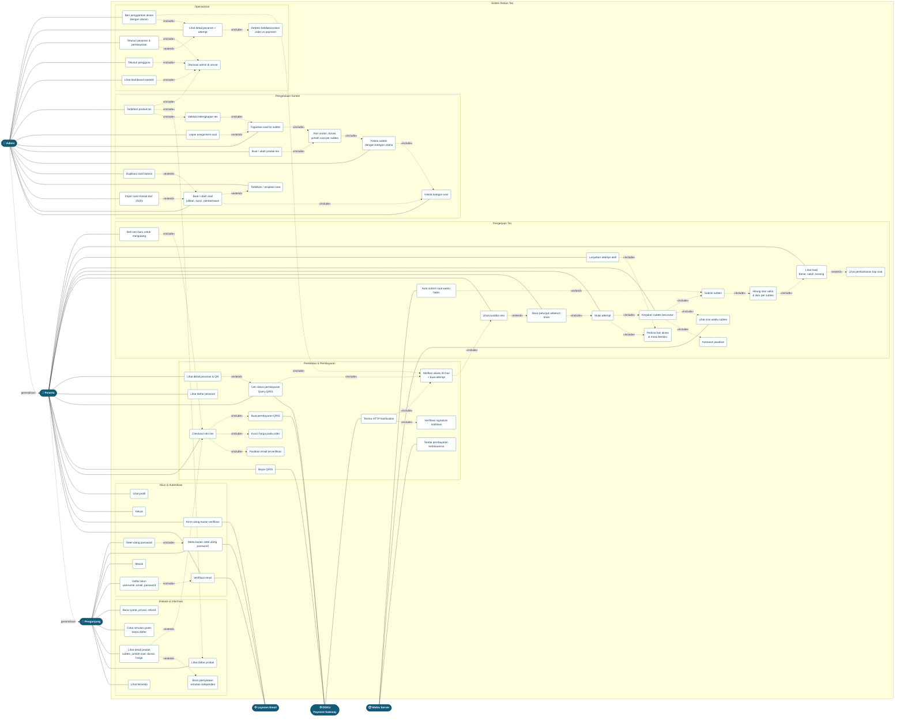

# Use Case Diagram — Rekan Tes

Diagram disusun dari kode yang benar-benar ada (`src/lib/*.ts`, route `src/app/**`)
dan disilangkan dengan user story pada [PRD.md](./PRD.md).

## Aktor

| Aktor | Peran |
|---|---|
| **Pengunjung** | Belum punya akun. Bisa melihat etalase dan mencoba simulasi gratis. |
| **Peserta** (`role = participant`) | Generalisasi dari Pengunjung. Membeli sesi, mengerjakan tes, melihat hasil. |
| **Admin** (`role = admin`) | Mengelola bank soal, subtes, produk tes, dan menangani masalah operasional. |
| **DOKU** (aktor sistem) | Payment gateway QRIS: generate QR, Query QRIS, HTTP Notification. |
| **Layanan Email** (aktor sistem) | Mengirim tautan verifikasi email dan setel ulang password. |
| **Waktu Server** (aktor waktu) | Memicu batas waktu subtes dan kedaluwarsa akses/pembayaran. |

## Diagram

## Catatan pemetaan ke kode

| Use case | Implementasi |
|---|---|
| Daftar, masuk, verifikasi, reset password | `src/lib/auth.ts` (Better Auth + plugin `username`), rute `/daftar`, `/masuk`, `/lupa-password`, `/reset-password` |
| Etalase & detail produk | `src/lib/produk.ts` → `listPublishedTests`, `getPublishedTest`; rute `/produk`, `/produk/[slug]` |
| Simulasi gratis | `src/app/simulasi/**` (data statis, tanpa auth) |
| Checkout & QRIS | `src/lib/order.ts` → `startCheckout`, `checkPaymentStatus`; `src/lib/doku.ts` |
| Notifikasi pembayaran | `src/app/api/doku/notifications/route.ts` → `verifyNotificationSignature` → `src/lib/webhook.ts` `activatePayment` |
| Mulai / kerjakan / submit | `src/lib/attempt.ts` → `startAttempt`, `saveAnswer`, `getResult`; aturan di `src/lib/attempt-flow.ts` |
| Bank soal & impor JSON | `src/lib/admin.ts` → `saveQuestion`, `createQuestions`, `duplicateQuestion`; `src/lib/question-import.ts` |
| Produk tes & assignment | `src/lib/admin.ts` → `saveTest`, `addAssignment`, `removeAssignment` |
| Validasi terbit | `src/lib/test-publish.ts` → `testPublishProblem` |
| Operasional admin | `src/lib/admin-user.ts`, `src/lib/admin-order.ts` (`grantReplacementAccess`), `src/lib/order-consistency.ts` |
| Otorisasi | `src/lib/authz.ts` → `requireUser`, `requireVerifiedUser`, `requireAdmin`, `assertOwner` |
